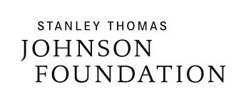

The «Alice Kober Gesellschaft für die Entzifferung antiker Schriftsysteme (GEAS)» has been founded in 2016 by Software Engineer Stephan Balmer and Bern University based linguist and archaeologist Michael Mäder with the support of Stanley Thomas Johnson Foundation [https://www.johnsonstiftung.ch/de/]. 

### The aims and activities pursued by GEAS can be summarized as follows:

- Promoting the international collaboration among scholars in the various fields concerned with script decipherment, i.e. interconnecting the fields of Historical Linguistics, Epigraphy, Mathematical and Computational Sciences, Graphematics, Archaeology.
- Developing a common terminology as well as a standardized, cross-linguistic methodology for the decipherment of ancient writing systems.
- Opening up the fields of palaeography, script archaeolgy and thechnical script decipherment to the public.
- Standardising the assessments of proposed decipherment attempts.
- Compiling comprehensive, Unicode-based text corpora of the writing systems examined.
- Providing either photographs or links to existing online corpora for each inscription.
- Enabling a fast and reliable search for grapheme sequences by REGEX-compliant, multi-parameter search functions.
- Using «Dynamic Syllabaries», i.e. state of the art lists of types and their probable graphic variants, instead of unflexible, intuition-based preconceptions. 
- Publishing preliminary results in peer-reviewed journals or in the home-grown «Begleitpapiere zum Entzifferungstool» reviewed by the GEAS scientific board.
- Providing open access Unicode fonts and ebabling scholars and enthusiasts to contribute to the research progress.

### Contact

Science: m.maeder@geass.ch
Administration: office@geass.ch
