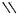
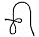
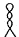
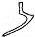
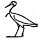
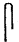
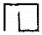
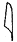

In 1990, Marwan Kilani pushed us to the boundaries by recommending Harvey Sobelman’s (1961) n-gram analysis and James Hoch’s (1990) suggestion of comparing the Byblos script to the Egyptian phonographic (consonantial) sub-alphabet. Departing from the successful sound value attribution of ;  pa  compared to  *p3* in Anchesen-pa-Aton’s name on the Berlin Familienstele, combined with the proposal of the logo-phonograms  ATON and  AMUN (because Anchesen-pa-Aton changed her name into Anchesen-pa-Amun in late Amarna period), the show must go on. Supervised by Michael Mäder, Elizabeth Schmutz conducted a sequency search for all signs showing graphical similarity (as understood by the GEAS Methodology for script comparison) to the Egyptian Syllabic Alphabet. In a preliminary report, we found out that it is exactly the group of the most frequent Byblos signs (i.e. the signs statistically most prone to depict high frequency syllables from late Phoenician) which has over-coincidence (low levenshteing distance) to Egyptian Syllabic signs. As Mäder puts it: «So hat, wie mir scheint, 
-  (1. Frequenzrang im Byblos-Syllabar ) sein Vorbild im ägyptischen Graphem  *i*, 
-  (2. Frequenzrang) hat sein Vorbild in  w or o , 
-  (3.) in  *ḥ*, 
-  (5.) in  *m*, 
-  (7.) in  *b*, 
-  (8.) in  *ś*, 
-  (11.) in  *h* und 
-  (12.) in  *ʾ*.  
This means that, among the 12 most frequent grapheme types of the Byblos Syllabary, 8 signs have a low levenshteing distance (LDg <2). And one Byblos sign with a proposed sound value (;  *pa*  discussed above) even has low graphical distance combined with a externally corroborated zero phonetic levenshtein distance (LDg <2 ∧ LDp = 0). 

Mäder will try to integrate this latest finding into his [Berlin Stele vs. Bylbos seal article](https://www.academia.edu/101593242/) in Ugarit Forschungen. The matches are extremely promising, because they a) could lead the path to internal (linguistic) confirmation of the suspictions given in the list above, and with that, serve as a late justification of the prudent, methodically soberly executed and actually ingenious approaches by Sobelman (1961) and Hoch (1990).

