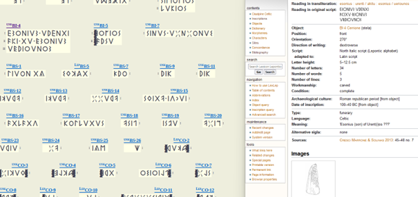

It is our duty to provide photographs to every inscription depicted in the GEAS Corpora. But in the case of Lepontic and Raetic, this would be double work. Instead of collecting and rendering images for each of the more than 600 inscripitons unicodified by GEAS, we decided to link each of the Leponticon and Raeticon inscriptions to the respective entrance in [LexLep] (https://lexlep.univie.ac.at/wiki/Main_Page) and [TIR] (https://tir.univie.ac.at/wiki/Main_Page). By clicking to the inscripiton’s sigla, the GEAS user gets immediate access to all the informations and literature presented in the Vienna corpora. In a short and seemingly painless effort, Corinna Salomon and GEAS system engineer Stephan Balmer discussed the technical preconditions, the adaptation of the LexLep/TIR sigla and the copyright questions and have finally unified the corpora. Not only users of the GEAS unicode corpora will benefit (and GEAS team by saving a lot of time...) but also users of the exhaustive and constantly up-to-date Vienna projects have now access to our REGEX based search engine, and can, of course, freely use the GEAS [Unicode fonts] (https://center-for-decipherment.ch/tool-introduction/) to conduct their research and publish their results with our beautiful Northitalic font.

