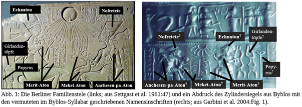

In an article soon to be published in Ugarit Forschungen, M. Mäder will suggest the first two sound value proposals for the Byblos Syllabary ever achieved by external evidence. A cylinder seal [read more] published by Garbini in 2004, depicting the three daughters of Achenaton and Nofretete together with three names written in Byblos script attached to them, is compared to the Berlin Familienstele showing the exact same scene, with the names written in Egyptian Hieroglyphs. As two of the daughter’s names, Merit-Aton and Meket-Aton, have the same initial syllable, ;  me is confirmed. The mirroring of the respective inscriptios even reflects the Egyptian original, where the direction of signs is chosen according to where the faces of the celebrities are heading to. The second sound value proposal, ;  pa, is found in the third child’s name Anchese-pa-Aton, and is externally corroborated by the graphical shape of the Hieroglyph   p3 from the Egyptian consonant alphabet, indeed found in the middle of Anchesen-pa-Aton’s name.

GEAS team is grateful to Marwan Kilani [https://unibasel.academia.edu/MarwanKilani/CurriculumVitae] for incentivising the digitalisation of Byblos script. In 2017, he was present at Nikolai Rawyler’s and Laura Higson’s Presentation of the decipherment tool on the occasion of the BAF Conference. Using his enthousiasm and in-depht knowledge of Egyptian writing, he encouraged us to attack the Byblos enigma. This lead to a deetection of morpheme boundaries (Presented at BAF again), and the sound value proposals discussed above. So thanks, Marwan, for your proof-reading, and your general scientific support.
