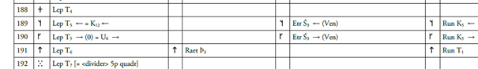
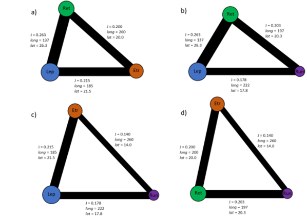

The collective GEAS project called PQN (Paleografia Quantitativa Norditalica) depicts every single graphic shape of the Lepontic/Brembonic/Cisalpine-Celtic, Raetic/Camunic, and Etruscan/Lemnic sub-alphabets.... and the Elder Futhark. 

The decision to include Germanic writing will potentially lead the Runenherkunft question to unexplored terrain. Spoiler ante publicationis: Of the 24 Elder Futhark main types, 22 have identical shapes to graphic variants from North Italic Alphabets, with 13 of them also representing identical sound values, and a further 8 representing similar sound values (i.e. same place of articulation, but different kind of articulation = Phonetic Levenshtein distance of 1 (LDp = 1). Table 2 (from PQN, cap. 3.4) demonstrates that every single rune (with its variants) has an identical predecessor in the North Italic Alphabets. The so-called group borrowing phenomenon – e.g. the k-rune  with its variants , , , ,  and  being a reflex of the North Italic velars  (Cam /k/),  (Cam /χ/),  (Ven /ks/),  (Cam /k/),  (Lep /k/; Lep /χ/),  (Ven G2),  and  (Cam /k/) – makes it mathematically impossible for the sound/shape congruencies being coincidental. In other words, the PQN table alone is the mathematical proof that the runes and are a subset of the Celtic alphabets.

Most importantly, there is quantitative evidence that the overall Jaccard Index between elder futhark Runes and, for example, Lepontic, is higher than some of the Jaccard Indices among the North Italic Alphabets themselves! This again forces us to consider the Germanic runes to be part of the North Italic alphabetic realm. Together with other arguments, we will present an overall rune origin theory at the ISRRI conference in Sankelmark, Germany. 

The paper has been accepted despite its provocative title, [«Norditalische und Germanische Runen»](https://www.isrri2022.uni-kiel.de/abstracts/#m%C3%A4der). Düwel & Nedoma refer to the abstract in the "Ursprung der Runenschrift" chapter of their 2023 volume of "Runenkunde".

The forthcoming Runology article is to be cited as:
*Mäder, Michael. "Rahmenquader-Effekt, Palindromoide und ein alter Knoblauchkult: Die Übernahme des Futhark aus den norditalischen Alphabetritualen." Tagungsband ’Functions of Runic Literacy 200 to 1500 AD. Ninth International Symposium on Runes and Runic Inscriptions (ISRRI), Akademie Sankelmark, Germany, 14-19 June 2022’ (Runrön 26).*

The presentation of the Unicode-based "Paleografia Quantitativa Norditalica" at the 2022 Pavia Conference for Celtic Archaeology, announced by GEAS SciDi M. Mäder, at the other hand, has been withdrawn. Unfortunately, private problems (the unexpected death of Mäder's mother and aunt) have lead to personal and financial troubles. This concerns the Gesellschaft as a whole, because Mäder's engagement had to be reduced to a minimum. At the same time, we have to regretfully announce the retirement of Sibylle Rogenmoser (office, (c)EndNote data typing). In the mean time, Eva van den Bolt will cover all the duties missed by the two, and we hope that Elizabeth Schmutz, (office, (c)EndNote, (c)InkScape Glyph creation) will rejoin us soon!

At any rate, we pre-publish the [PQN in the Begleitpapiere Journal (No. 2023/1)](https://center-for-decipherment.ch/journal/). For using this most exhaustive collection of graphic variants of the Celtic Alphabets of Northern Italy, feel free and download the GEAS Font collection.
