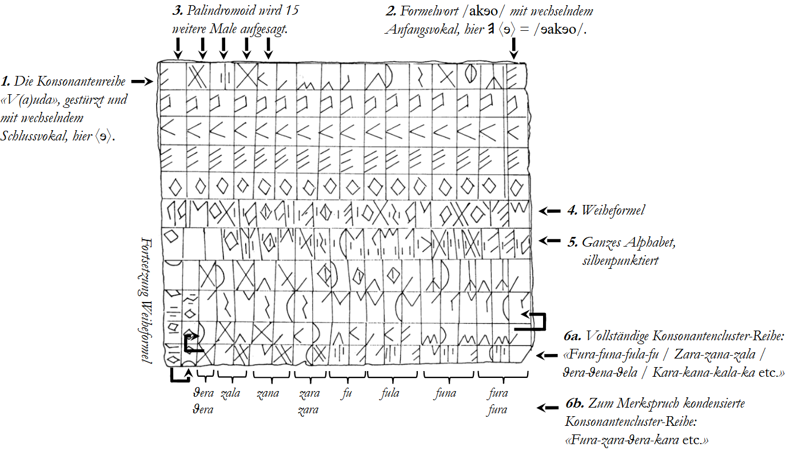
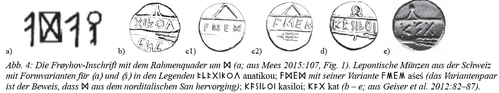
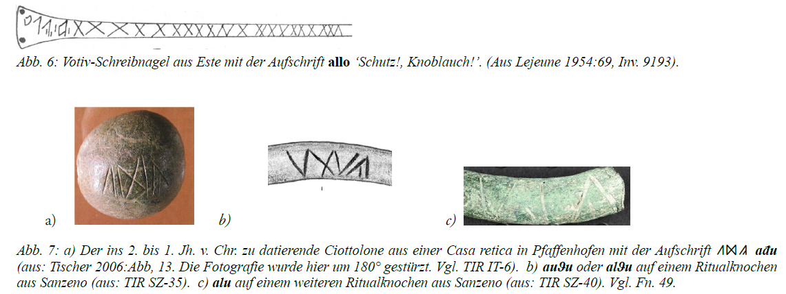

The GEAS RPT is a multi-disciplinary long-term endeavour envisaging an overall theory of the genesis of runic writing. The outline of parts 1 to 4 presented below gives insight into the content of the following publications: 

* Mäder, Michael (im Druck): „Der Fura-zara-kara-Merkspruch, der Rahmenquader-Effekt und ein alter Knoblauchkult: Die Übernahme des Futhark aus den norditalischen Alphabetritualen.“ Tagungsband ’Functions of Runic Literacy 200 to 1500 AD. Ninth International Symposium on Runes and Runic Inscriptions (ISRRI), Akademie Sankelmark, Germany, 14-19 June 2022’ (Runrön 26).
* Mäder, Michael; Schregenberger, Joël (demnächst): Die Runen und die norditalischen Alphabete: Eine quantitativ-paläografische Untersuchung im Lichte der Schriftentlehnungs-Typologie (mit einer umfassenden Runenherkunfts-Bibliografie von J. Schregenberger). Oppenheim: Nünnerich-Asmus Verlag.
* Mäder, Michael; Amadori, Sara (2023): Norditalische und germanische Runen im Lichte der Drop-in-Entlehnung: Neues aus Archäologie und quantitativer Linguistik
* ISRRI abstract [https://www.isrri2022.uni-kiel.de/abstracts/#m%C3%A4der]; 
* See also the hints on the GEAS RPT in R. Nedoma / K. Düwel (2023): Runenkunde (5., aktualisierte und erweiterte Aufl.), p. 239.

---

**Part 1: 
Solving problems that traditionally prevented scholars from accepting the 
North Etruscan (North Italic) Thesis**

1.1
* Problem: The time gap between NI and runic writing
* Solution: Closed by recent archaeological finds

1.2
* Problem: Eclecticism, i.e. the arbitrary selection of single signs from different NI sub-alphabets
* Solution: Mercenary Thesis, i.e. the inevitable eclecticism in non-didactical script transfer

1.3 
* Problem: The intransparent emergence of "germanic" sign shapes
* Solution: Accoding to PQN there are no purely germanic signs, i.e. every single rune (main type or    	    variant) has its exact predecessor in NI writing

1.4 
* Problem: Geographical distance and intransparent distribution pattern of the early runes
* Solution: Mercenary Thesis

1.5
* Problem: The lack of any consistent alphabetary before 700 AD
* Solution: Mercenary Thesis, i.e. the inevitable eclecticism in non-didactical script transfer

**Part 2: 
Qualitative Palaeography: Bringing up detailed theories to explain particular palaeographical and archaeological issues** 
2.1  The Fura-zara-kara mnemonic as origin of the Futhark order
2.2  The inevitable 'Rahmenquader' Effect as origin of new sign forms
2.3  The inevitable 180°-inversion of the learning tablets as origin of inverted forms
2.4  The Coexistence of seemingly NI and seemingly runic sign forms on lepontic coins
2.5  NI predecessors and etymologies of runic formula words (alu, laukr, laþu) 
2.6  NI predecessors of non-linguistic and logographic signs (feather sign, word dividers)
2.7  NI predecessors of non-linguistic sign sequences

**Part 3: Quantitative Palaeography: Bringing up grapho-phonetical and  grapho-mathematical proofs for the script adaptation**
3.1  Jaccard Index
3.2  Levenshtein Distance 
3.3  Probabilistic proofs of allograph group borrowings

**Part 4: Philology: Reading and translating rune inscriptions by the use of NI sound values**
4.1  The Frøyhov inscription
4.2  The Weser runes
4.3  The stool of Wremen
4.4  The Meldorf inscription 
4.5  Kaiser Friedrich's  A.E.I.O.U.

**Part 5: Experimental Archaeology and theatrical documentary: Delivering a detailed, evidence-based sketch of the mercenary thesis**
5.1  Reenacting 470 BC life in rural Helvetia: The Iluis Glanna Celtic Clan 
5.2  Contributions by Experimental Archaeology
5.3  Contributions by Experimental Linguistics
5.4  The Terra X documentary

**The most telling figures from the GEAS publications:**

